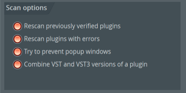
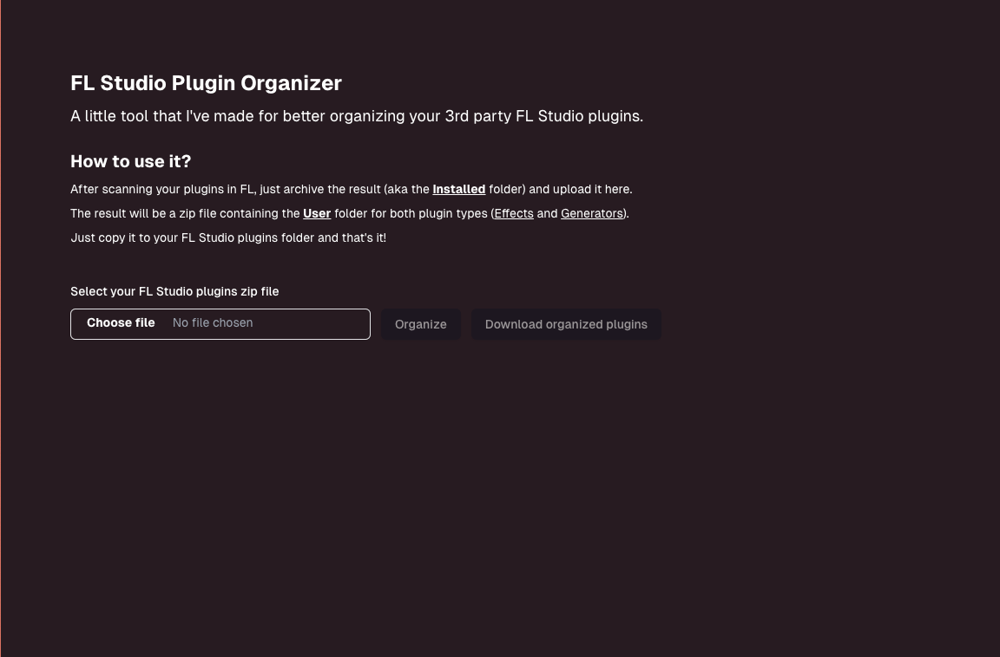
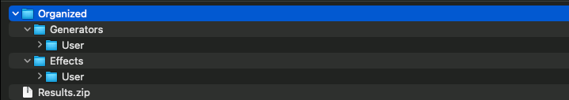
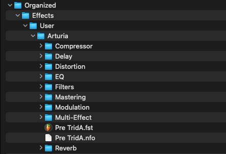
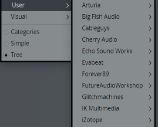

# FL Studio Plugin Organizer

This is a little tool that I've made for better organizing your 3rd party FL Studio plugins.

## Pre-requisites

In order to use this tool, you need to have [Docker](https://docs.docker.com/engine/install/) installed on your machine.

### In FL Studio   
Scan your plugins and make sure to enable all the scanning options, so that you'll make all the plugins available for organization.



## EXTRA: Want to enhance the organization?

You can add an even greater level of organization by following the instructions below:

1. Navigate to ```backend/src/main/resources/metadata/plugins-metadata.json```.
2. Inside this file, you can add your own structure as follows:
```
// This represents an array; you can specify as many plugins types as you want
[
    {
        "type": "Reverb", // the plugin type
        "pluginNames": [
            // list here your plugin names that you want in this type
            // e.g. 
            "Rev LX-24",
            "Rev PLATE-140",
            "Little Plate"
        ]
    },
    {
        "type": "Delay",
        "pluginNames": [
            "kHs Delay",
            "kHs Dual Delay"
        ]
    }

    // etc.
]
```

## Usage

Open a terminal at the root of the project and run the following command:

```bash
API_URL=http://localhost:8080 docker-compose up --detach
```

This will build everything that you need and start the tool.

After everything is started, you can access the tool at [http://localhost:3000](http://localhost:3000).

You should see the following screen:



Just follow the instructions and you're done!

## The result

The result will be a zip file containing the **User** folder for both plugin types (**Effects** and **Generators**).



With the extra metadata file, it can look like this:



Just replace the **User** folder from your FL Studio plugins folder and that's it, you should see your new structure in FL!



## Other mentions

If you have any questions/issues, feel free to open an issue or contact me via Discord **(@peter_phunk)**  