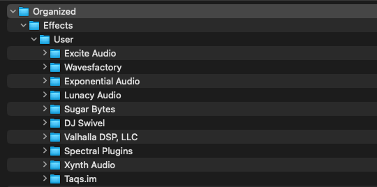

# FL Studio Plugin Organizer

This is a little tool that I've made for better organizing your 3rd party FL Studio plugins.

## Pre-requisites

In order to use this tool, you need to have [Docker](https://docs.docker.com/engine/install/) installed on your machine.

### In FL Studio   
Scan your plugins and make sure to enable all the scanning options, so that you'll make all the plugins available for organization.


## Usage

From the root of this repository, run the following command:

```bash
API_URL=http://localhost:8080 docker-compose up --detach
```

This will build everything that you need and start the tool.

After everything is started, you can access the tool at [http://localhost:3000](http://localhost:3000).

You should see the following screen:


Just follow the instructions and you're done!

## The result

The result will be a zip file containing the **User** folder for both plugin types (**Effects** and **Generators**).



Just replace the **User** folder from your FL Studio plugins folder and that's it, you should see your new structure in FL!


## Other mentions

If you have any questions/issues, feel free to open an issue or contact me via Discord **(@peter_phunk)**  